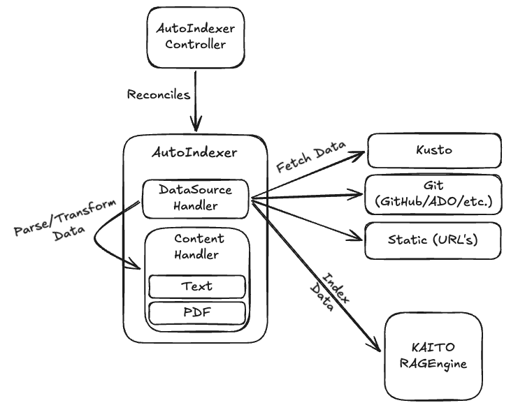

# AutoIndexer


[](https://goreportcard.com/report/github.com/kaito-project/autoindexer)


AutoIndexer is a Kubernetes operator that automates the indexing of documents from various data sources into [KAITO RAGEngine](https://kaito-project.github.io/kaito/docs/rag) services. It streamlines the process of building knowledge bases for Retrieval Augmented Generation (RAG) workflows by automatically ingesting content from Git repositories, static URLs, and databases into vector indexes.

The operator handles the complete lifecycle of document indexing including:
- **Automated data ingestion** from multiple source types
- **Scheduled indexing** with cron-based scheduling
- **Drift detection and remediation** to maintain data consistency
- **Multi-format support** for text and PDF documents
- **Authentication management** with secrets and workload identity
- **Integration** with KAITO RAGEngine for vector storage

## Architecture

AutoIndexer follows the Kubernetes Custom Resource Definition (CRD)/controller design pattern. Users manage an `AutoIndexer` custom resource that describes the data source configuration, indexing requirements, and scheduling preferences. The AutoIndexer controller automates the indexing workflow by reconciling the `AutoIndexer` custom resource.

<div align="left">
  
</div>

The architecture consists of:

- **AutoIndexer Controller**: Reconciles `AutoIndexer` custom resources, manages indexing jobs, handles scheduling, and performs drift detection
- **Indexing Jobs**: Python-based jobs that handle the actual document processing, content extraction, and communication with RAGEngine services
- **Data Source Handlers**: Pluggable handlers for different data source types (Git, Static URLs, Databases)
- **Content Handlers**: Process different document formats (text, PDF) and extract indexable content
- **RAGEngine Integration**: Seamless integration with KAITO RAGEngine for document storage and retrieval

## Features

### **Automated Document Indexing**
- Automatic discovery and processing of documents from configured data sources
- Support for incremental indexing to handle only new or changed content
- Batch processing for efficient large-scale document ingestion

### **Multiple Data Sources**
- **Git Repositories**: Index code, documentation, and text files from public or private Git repositories
- **Static URLs**: Process individual documents from web URLs (text and PDF formats)
- **Databases**: Query and index content from databases using languages like Kusto (KQL)

### **Flexible Scheduling**
- Cron-based scheduling for automated, recurring indexing
- Manual trigger support for on-demand indexing
- Suspend/resume functionality for maintenance windows

### **Drift Detection & Remediation**
- Automatic detection of data inconsistencies between source and index
- Configurable remediation strategies: Auto, Manual, or Ignore
- Comprehensive monitoring and alerting for drift events

### **Secure Authentication**
- Kubernetes Secret-based credentials for private repositories and APIs
- Azure Workload Identity integration for cloud-native authentication
- Flexible credential provider system for extensibility

### **Observability & Monitoring**
- Comprehensive status reporting with phase tracking
- Detailed metrics on indexing success, failure, and performance
- OpenTelemetry integration for distributed tracing and logging

## Installation

### Prerequisites
- Kubernetes cluster (1.24+)
- KAITO RAGEngine deployed and accessible
- kubectl configured for cluster access

## Quick Start

After installing AutoIndexer, you can create your first indexing workflow:

### 1. Create a RAGEngine (if not already deployed)

```yaml
apiVersion: kaito.sh/v1alpha1
kind: RAGEngine
metadata:
  name: my-ragengine
spec:
  inference:
    preset:
      name: text-embedding-ada-002
```

### 2. Create an AutoIndexer for Git Repository

```yaml
apiVersion: autoindexer.kaito.sh/v1alpha1
kind: AutoIndexer
metadata:
  name: docs-indexer
spec:
  ragEngine: my-ragengine
  indexName: documentation-index
  schedule: "0 */6 * * *"  # Index every 6 hours
  dataSource:
    type: Git
    git:
      repository: "https://github.com/kubernetes/website.git"
      branch: "main"
      paths:
        - "content/en/docs/"
      excludePaths:
        - "*.png"
        - "*.jpg"
```

### 3. Monitor the Indexing Progress

```bash
# Check AutoIndexer status
kubectl get autoindexers

# Watch indexing progress
kubectl get autoindexers docs-indexer -o yaml

# View indexing job logs
kubectl logs -l autoindexer.kaito.sh/name=docs-indexer
```

## Data Sources

### Git Repositories

Index documentation, code, and text files from Git repositories:

```yaml
dataSource:
  type: Git
  git:
    repository: "https://github.com/example/repo.git"
    branch: "main"
    commit: "abc123"  # Optional: specific commit
    paths:
      - "docs/"
      - "*.md"
      - "src/**/*.py"
    excludePaths:
      - "docs/archive/"
      - "*.test.py"
```

**Features:**
- Support for public and private repositories
- Branch and specific commit targeting
- Flexible path inclusion/exclusion with glob patterns
- Incremental indexing based on commit history

### Static URLs

Process individual documents from web endpoints:

```yaml
dataSource:
  type: Static
  static:
    urls:
      - "https://example.com/document1.pdf"
      - "https://example.com/document2.txt"
      - "https://api.example.com/content"
```

**Features:**
- Support for text and PDF documents
- UTF-8, UTF-8-SIG, Latin1 encoding detection
- Custom headers and authentication via credentials

### Database Sources

Query and index structured data from databases:

```yaml
dataSource:
  type: Database
  database:
    language: Kusto
    initialQuery: |
      MyDatabase
      | where Timestamp > ago(30d)
      | project Content, Title, Metadata
    incrementalQuery: |
      MyDatabase  
      | where Timestamp > datetime({last_run})
      | project Content, Title, Metadata
```

**Features:**
- Support for Kusto Query Language (KQL)
- Incremental query support for large datasets
- Extensible architecture for additional database types

## Authentication

### Kubernetes Secrets

Store credentials in Kubernetes secrets:

```yaml
# Secret containing authentication token
apiVersion: v1
kind: Secret
metadata:
  name: git-credentials
type: Opaque
stringData:
  token: "ghp_your_github_token_here"
---
# AutoIndexer using the secret
spec:
  credentials:
    type: SecretRef
    secretRef:
      name: git-credentials
      key: token
```

### Azure Workload Identity

Use Azure Workload Identity for cloud-native authentication:

```yaml
spec:
  credentials:
    type: WorkloadIdentity
    workloadIdentity:
      cloudProvider: Azure
      azureWorkloadIdentity:
        serviceAccountName: autoindexer-sa
        scope: "https://storage.azure.com/.default"
        clientID: "12345678-1234-1234-1234-123456789012"
        tenantID: "87654321-4321-4321-4321-210987654321"
```

## Scheduling and Drift Detection

### Cron-based Scheduling

Schedule regular indexing with standard cron syntax:

```yaml
spec:
  schedule: "0 2 * * *"    # Daily at 2 AM
  # schedule: "*/15 * * * *" # Every 15 minutes
  # schedule: "@daily"       # Daily at midnight
  # schedule: "@weekly"      # Weekly on Sunday at midnight
```

### Drift Detection

AutoIndexer automatically detects when the actual document count in an index differs from the expected count:

```yaml
spec:
  driftRemediationPolicy:
    strategy: Auto  # Options: Auto, Manual, Ignore
```

**Remediation Strategies:**
- **Auto**: Automatically delete and recreate the index when drift is detected
- **Manual**: Require manual intervention and approval for remediation  
- **Ignore**: Disable drift detection for this AutoIndexer

## Configuration

### Environment Variables

Configure the AutoIndexer controller using environment variables:

| Variable | Description | Default |
|----------|-------------|---------|
| `DRIFT_DETECTION_ENABLED` | Enable/disable drift detection | `true` |
| `DRIFT_DETECTION_INTERVAL` | Interval between drift checks | `1h` |
| `INDEXER_JOB_IMAGE` | Container image for indexing jobs | `autoindexer:latest` |
| `INDEXER_JOB_TIMEOUT` | Timeout for indexing jobs | `3600s` |

## API Reference

### AutoIndexer Spec Fields

| Field | Type | Description |
|-------|------|-------------|
| `ragEngine` | string | Name of the RAGEngine resource to use |
| `indexName` | string | Name of the index for document storage |
| `dataSource` | DataSourceSpec | Configuration for the data source |
| `credentials` | CredentialsSpec | Authentication configuration |
| `schedule` | string | Cron schedule for automatic indexing |
| `suspend` | bool | Suspend scheduled indexing |
| `driftRemediationPolicy` | DriftRemediationPolicy | Drift detection configuration |

### AutoIndexer Status Fields  

| Field | Type | Description |
|-------|------|-------------|
| `indexingPhase` | string | Current phase: Pending, Running, Completed, Failed, etc. |
| `lastIndexingTimestamp` | Time | Timestamp of last successful indexing |
| `numOfDocumentInIndex` | int32 | Number of documents currently in the index |
| `successfulIndexingCount` | int32 | Count of successful indexing runs |
| `errorIndexingCount` | int32 | Count of failed indexing runs |
| `nextScheduledIndexing` | Time | Next scheduled indexing time |

## Troubleshooting

### Common Issues

**AutoIndexer stuck in Pending phase:**
```bash
# Check for missing RAGEngine
kubectl get ragengine

# Verify credentials are properly configured
kubectl get secrets
```

**Indexing jobs failing:**
```bash
# Check job logs
kubectl logs -l autoindexer.kaito.sh/name=your-autoindexer

# Verify data source accessibility
kubectl exec -it debug-pod -- curl -I https://your-data-source-url
```

**Drift detection false positives:**
```bash
# Temporarily disable drift detection
kubectl patch autoindexer your-autoindexer --type='merge' \
  -p='{"spec":{"driftRemediationPolicy":{"strategy":"Ignore"}}}'
```

AutoIndexer is part of the [KAITO project](https://github.com/kaito-project/kaito) - Kubernetes AI Toolchain Operator.
